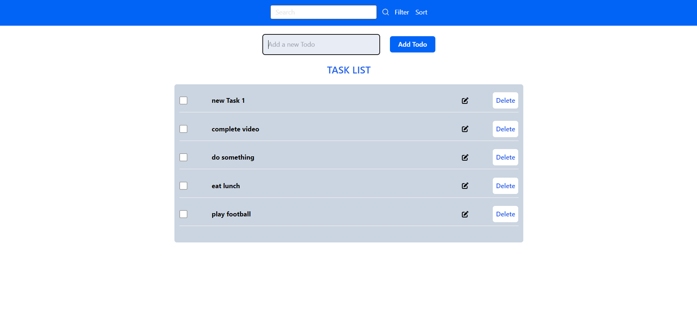
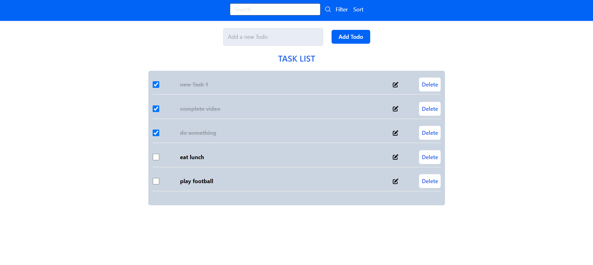
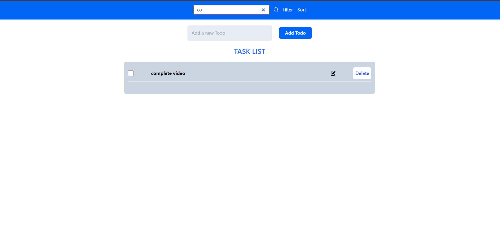
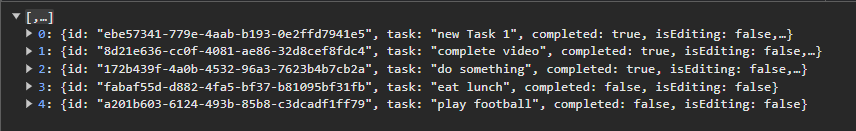

# My To-Do App

This is a simple React To-Do List application that allows users to add, remove, and mark tasks as completed. It includes  features like sorting, filtering, and localStorage integration.

## Features
- Add new tasks
- Remove tasks
- Mark tasks as completed
- Search for tasks
- sorting and filtering
- Save tasks to localStorage

## Testing the Application

To ensure the application works as expected, follow these testing steps:

1. **Add a Task:**
   - Enter a task description in the input field.
   - Click the "Add" button or press "Enter".
   - Verify the task appears in the list.

2. **Remove a Task:**
   - Click the "Delete" button next to a task.
   - Confirm the task is removed from the list.

3. **Mark Task as Completed:**
   - Check the box next to a task.
   - Ensure the task text is struck through, indicating completion.

4. **Search for Tasks:**
   - Enter a keyword in the search bar.
   - Check that the list updates to show only matching tasks.

5. **Persist Tasks with localStorage:**
   - Add tasks and then refresh the page.
   - Verify that tasks persist and reload correctly.

By following these steps, you can validate the core functionalities of the To-Do List application.


## Setup and Installation

1. **Clone the repository:**
   ```bash
   git clone https://github.com/yourusername/my-todo-app.git
   cd my-todo-app
## Screenshots







